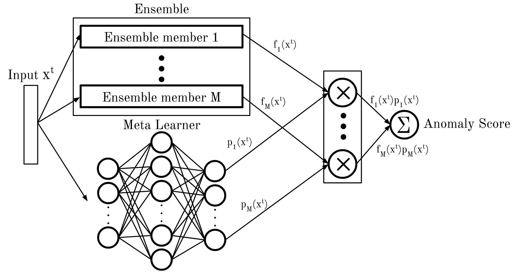

# Master's Thesis
__by: Jonas Lundgren__

My master’s thesis, currently in progress. Written as a part of the Master of Science in Engineering Mathematics degree at the Faculty of Engineering at Lund University.  It was written during the spring of 2020 and was done in collaboration with Sentian.ai in Malmo.

## Abstract

In this thesis a framework for finding anomalies in data is proposed. The framework proposed is not necessarily only applicable for problems in anomaly detection, but could be applied to other problems as well. There are three main concepts at play in the framework: (i) _Active Learning_, a learning algorithm which can query a human specialist for labels of instance where the model can improve, of an otherwise unlabeled data set. (ii) _Ensembles_ which is a combination of models, often weaker models, where the idea is that the combined result from all models will mitigate the error in every single model and thus provide better results. (iii) _Meta learning_ which is the concept of having a model learn model characteristics for a problem, for example how the learners in the ensemble should be weighted depending on a single sample. 

Most algorithms for anomaly detection try to model some probability density function of normal instances _f_X(x)_, where the set of instances _X_ often contains both the anomalous and normal instances. The model labels instances as anomalous or normal based on the likelihood for that instances to belong to the modeled distribution. Therefore AD models tend to present outliers in the modeled distribution as anomalies. The problem is thus reduced to measuring distances from an expected value to the instance. This type of approach has shortcomings, as it, for cases where anomalies occur within the distribution and for cases where normal instances happen to lie far from the center of the distribution and thus result in an unnecessarily high amount of false categorisations. Having a human expert providing labels for instances, in an otherwise unsupervised setting during training is one way of improving the model without having to label all instances. The modeled distribution _f_X(x)_ will change, to accommodate the labels provided. Using meta learning in conjunction with ensembles promotes the inherent strength of using ensembles. If the an ensemble members preforms well in one area of the feature space (categorizing all instances in that area correctly) while preforming worse in other areas of the feature space (not categorizing all instances correctly), then we want to promote that ensemble member for instances in the part of the feature space in which that ensemble member preforms well and suppress it for instances in other parts of the feature space. The framework is displayed in the Figure below. The meta learner takes instances as input and output weights for each ensemble member according to it's performance of previous similar instances. Thus the total output is a dynamically weighted ensemble output where the weighting is based on the input. When a human expert provides label feedback on miss classified instances only the meta learner is updated in order to provide new weights for the ensemble to suppress the error and not the entire ensemble. 

To summarise we want to leverage that different ensemble members have different characteristics which makes them more or less suitable to make predictions for certain instances. We weight the ensemble members by a neural network, taking the instance as input to weight the ensemble members in accordance to their capacity to make a prediction for certain instances. This could be leveraged even further, having different ensemble members trained on different parts of the feature space. The loss to train the neural network is composed of two parts, the first a supervised part _loss{active}_, using the labels provided by a human expert, and a second part _loss{prior}_ which places a uniform prior on the ensemble members. When new labels are provided the meta learner is updated to don't miss classify any of the labeled instances.  

## Example of anomaly detection system at work (as of 2020-03-28)

## Example of anomaly detection system at work (as of 2020-06-05)

### GIF explanation
__Top figure__
- __Blue line__: Time-series from Yahoo Webscope benchmark data set.
- __Red x__: True anomalies
- __Green line _(40 data points)___: Input sliding window.
- __Red line _(100 data points)___: When querying label {anomaly, normal} the oldest 20% in ensamble is updated and trained on this red sliding window, i.e. the 100 most recent data points.
- __Green points__: Queries to human expert
- __Yellow points__: Predicted anomalies

__Bottom figure__
- __Purple line__: Anomaly score
- __Red line__: Threshold = 0.5
